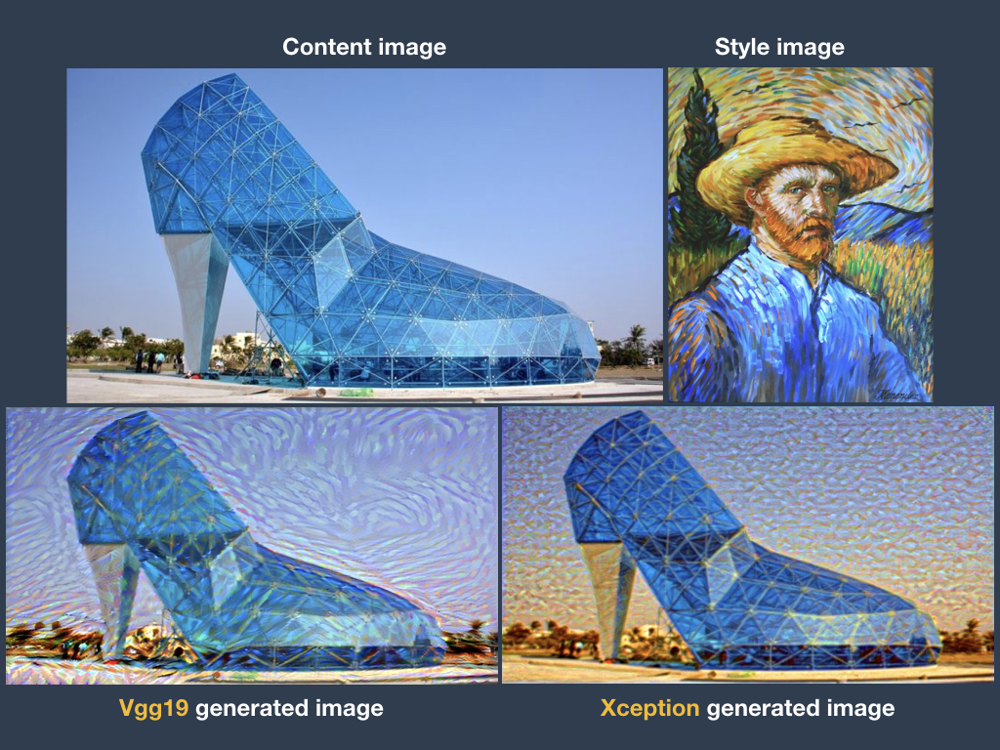
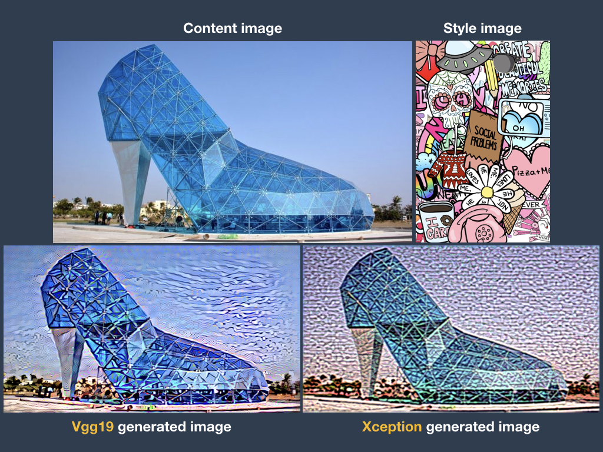
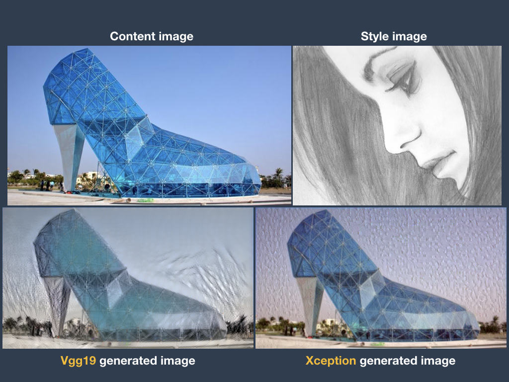

# Artistic-Style-Transfer-Vgg19-vs.-Xception-model
## Project Overview
### Project Description
Use Vgg19 and Xception pre-trained model to do artistic style transfer which obtain a representation of the style of an input image and apply the style to another image while keeping the original image content recognizable.

### Project Procedure
- Preprocess the image to a 4D tensor
- Build the model
  - Create a input tensor with shape (3, height, width, channels or filters)
  - Load the pre-trained model
    - Vgg19
    - Xception
- Calculate loss
  - content loss
  - style loss
  - total variance loss
- Run the model
- Deprocess the image
- Visualize the generated image

if want to keep training
 - reload the saved weights
 - train the model

### Project Results
- Project Output

 
 
 


## Getting Started
### Prerequisites

This project requires **Python 3.6** and the following Python libraries installed:

- [NumPy](http://www.numpy.org/)
- [matplotlib](http://matplotlib.org/)
- [Keras](https://keras.io/)
- [SciPy](https://www.scipy.org/install.html)

### Run
In a terminal or command window, run one of the following commands:

```bash
ipython notebook Your_first_neural_network.ipynb
```  
or
```bash
jupyter notebook Your_first_neural_network.ipynb
```

This will open the iPython Notebook software and project file in your browser.
